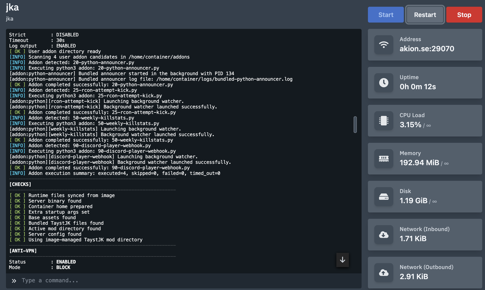

<h1 align="center">Jedi Academy Pterodactyl (TaystJK)</h1>

<strong>Pterodactyl image and egg for TaystJK, with manual game asset handling, lightweight Bash/Python addons, and optional anti-VPN runtime protection.</strong>

  
  
  
  
   
  
  
  

  <a href="https://github.com/akiondev/jedi-academy-pterodactyl/blob/main/egg/egg-jka-taystjk-modern64-pterodactyl.json"><strong>Download EGG</strong></a>
  &nbsp;•&nbsp;
  <a href="https://github.com/taysta/TaystJK"><strong>TaystJK</strong></a>
  &nbsp;•&nbsp;
  <a href="https://github.com/JACoders/OpenJK"><strong>OpenJK</strong></a>
  &nbsp;•&nbsp;
  <a href="https://jkhub.org"><strong>JKHub.org</strong></a>
  &nbsp;•&nbsp;
  <a href="https://github.com/akiondev/jedi-academy-pterodactyl/issues/new?title=BUG:%20"><strong>Report Bug</strong></a>
  &nbsp;•&nbsp;
  <a href="https://github.com/akiondev/jedi-academy-pterodactyl/issues/new?title=REQUEST:%20"><strong>Request Feature</strong></a>

Pterodactyl Docker image and egg for running a **TaystJK** dedicated server without redistributing copyrighted **Jedi Academy** game assets.

Built around [TaystJK](https://github.com/taysta/TaystJK) by [taysta](https://github.com/taysta). This repository packages that runtime for Pterodactyl and adds the surrounding image, egg, startup, addon, and admin tooling.

This image is designed to keep the default **`taystjkded.x86_64`** server binary up to date automatically, so you do not need to upload new TaystJK server files manually. If you choose to run a different server binary yourself, that manual binary is left untouched.

License: **GPL-3.0**

  

## What is Pterodactyl?

This repository is meant to be used with Pterodactyl.

[Pterodactyl](https://pterodactyl.io/) is an open-source game server management panel. It runs servers inside Docker containers and gives you a web interface for installing, starting, stopping, and managing them.

In Pterodactyl, an **egg** is a server template. It defines how a server should be installed, configured, and started inside the panel.

This repository provides the Docker image and Pterodactyl egg for running a TaystJK-based Jedi Academy server in that environment.

Official Pterodactyl documentation:
[pterodactyl.io/project/introduction.html](https://pterodactyl.io/project/introduction.html)

If you want the fastest way to get started with Pterodactyl itself, there is also an unofficial installer project:
[pterodactyl-installer/pterodactyl-installer](https://github.com/pterodactyl-installer/pterodactyl-installer)

Warning: this is not an official Pterodactyl installation method. Follow the linked project's instructions carefully; on some systems, you may need to already be logged in as `root`.

## Quick install

1. Import [egg/egg-jka-taystjk-modern64-pterodactyl.json](egg/egg-jka-taystjk-modern64-pterodactyl.json) into Pterodactyl.
2. Create a server with the runtime tag you want, for example `ghcr.io/akiondev/jedi-academy-pterodactyl:taystjk-modern64`. A Docker Hub mirror is published in parallel at `docker.io/akiondev/jedi-academy-pterodactyl` when configured.
3. Set `COPYRIGHT_ACKNOWLEDGED=true`.
4. Add your legally owned Jedi Academy base assets manually into `/home/container/base`.
5. Start the server. The runtime creates `/home/container/config/jka-runtime.json` from the shipped template on first start; edit that file to change behavior.
6. Verify that `/home/container/base/assets0.pk3` exists.

> **Migration note (image rename)**
> Earlier builds were published as `ghcr.io/akiondev/jedi-academy-taystjk`. The platform image is now published under the Pterodactyl-centered name `ghcr.io/akiondev/jedi-academy-pterodactyl` (and mirrored to Docker Hub as `akiondev/jedi-academy-pterodactyl`). Existing servers can switch by editing the server's docker image to the new path; the underlying TaystJK runtime is identical. The legacy GHCR package will remain reachable for an interim period to avoid breaking existing deployments. See [docs/image-strategy.md](docs/image-strategy.md) for the full image and tag policy.

## Manual-first egg model

The egg exposes only four panel variables. Everything else is configured through `/home/container/config/jka-runtime.json` and through your own `server.cfg`.

| Variable | Purpose |
| --- | --- |
| `COPYRIGHT_ACKNOWLEDGED` | Required acknowledgment that you legally own the Jedi Academy base assets you upload. |
| `EXTRA_STARTUP_ARGS` | Optional extra arguments appended to the dedicated server command line. |
| `SERVER_BINARY` | Path of the dedicated server binary under `/home/container`. Treated as a manual user-owned path unless auto-update is on. |
| `TAYSTJK_AUTO_UPDATE_BINARY` | When `true`, the runtime overwrites `/home/container/taystjkded.x86_64` from the image-managed TaystJK build on every start and ignores `SERVER_BINARY`. When `false` (default), no engine binary is ever overwritten. |

Behavior switches that used to live in the egg (anti-VPN, RCON guard, addons, event bus, hostname/MOTD/maxclients/gametype/rconpassword, debug, live-output mirror, FS_GAME_MOD, SERVER_CONFIG, SERVER_LOG_FILENAME, server.cfg overrides, addon enable flags, etc.) now live in `/home/container/config/jka-runtime.json`. Provider API keys must be written into that file by the server owner; they are no longer accepted as panel variables.

The runtime never overwrites an existing `jka-runtime.json`; an `jka-runtime.example.json` template is refreshed alongside it on every start so you can compare against the latest shipped defaults.

## Manual alternatives

1. Upload your own dedicated server binary into `/home/container`, then set `SERVER_BINARY` to that file, for example `./openjkded.x86_64`. Leave `TAYSTJK_AUTO_UPDATE_BINARY=false` (the default) so the binary is not overwritten.
2. Upload your own mod folder into `/home/container/<modname>`, then set `server.fs_game` in `/home/container/config/jka-runtime.json` to that folder name, for example `japlus` or `mbii`.
3. Place the active config file inside that mod folder and set `server.config` in `jka-runtime.json` if you are not using `server.cfg`.
4. Start the server. The runtime will launch manual binaries and mod folders if they exist, but it will not install, sync, or manage them for you.

## Runtime tags and update policy

The project publishes a single runtime family — `taystjk-modern64` — under the following tags:

- `latest` (default branch only)
- `taystjk`
- `taystjk-modern64`
- `taystjk-modern64-master-<short_sha>` (immutable, derived from upstream TaystJK master HEAD)

Auto-updating upstream TaystJK engine: yes (rebuilt and republished when upstream master changes).

## What this repo contains

- `docker/taystjk-modern64/Dockerfile` — source-built runtime image for TaystJK
- `egg/egg-jka-taystjk-modern64-pterodactyl.json` — importable Pterodactyl egg
- `scripts/entrypoint.sh` — runtime preparation and launch helper
- `scripts/install_taystjk.sh` — standalone install helper
- `cmd/taystjk-antivpn` — Go-based anti-VPN supervisor for runtime join checks
- `docs/addon_readme.md` — compact addon usage guide with quick examples
- `docs/addon_readme_advanced.md` — full addon reference for developers and AI-guided scripting
- `docs/anti-vpn.md` — anti-VPN design, variables, scoring and operating notes
- `docs/operator-sheet.md` — short panel-only crib sheet for the TaystJK modern64 runtime
- `docs/panel-testing.md` — full step-by-step Pterodactyl panel walkthrough

## Key behavior

- Builds the dedicated server from TaystJK source
- Tracks TaystJK `master` through image builds, and can automatically rebuild and publish the default image-managed runtime when upstream changes are detected
- Does **not** bundle `assets*.pk3` or other copyrighted base game files
- Requires server owners to provide their own legally owned Jedi Academy base assets manually in `/home/container/base`
- Uses `server.fs_game="taystjk"` from `/home/container/config/jka-runtime.json` by default
- Allows switching to manually installed mod folders such as `base`, `japlus`, `japro`, or `mbii` by editing `server.fs_game` in `jka-runtime.json`
- Allows switching to a manually uploaded alternative dedicated server binary through `SERVER_BINARY` (with `TAYSTJK_AUTO_UPDATE_BINARY=false`)
- Supports lightweight runtime addons from `/home/container/addons` using top-level `.sh` and `.py` scripts executed alphabetically before normal startup
- Syncs `ADDON_README.md` and `ADDON_README_ADVANCED.md` automatically into `/home/container/addons/docs`
- Ships managed default addons (Python announcer, event-driven live team announcer, event-driven chatlogger) in `/home/container/addons/defaults`, all disabled by default — enable an addon by editing its own `*.config.json` file
- Optional anti-VPN supervision using online API checks with cache, allowlist, structured logging and weighted decisions; PASS and BLOCKED announcements are broadcast to chat by default

## Managed vs manual paths

This repository is intentionally **TaystJK-first**:

- the Docker image automatically builds the TaystJK dedicated server runtime
- when `TAYSTJK_AUTO_UPDATE_BINARY=true`, the image-managed `taystjkded.x86_64` is synced into `/home/container` on every start
- when `server.sync_managed_taystjk_payload=true` (default) in `jka-runtime.json`, the image-managed `taystjk/` mod payload is mirrored into `/home/container/taystjk` on every start
- when a newer image-managed TaystJK runtime is published, servers using auto-update receive the newer binary on the next start that uses the refreshed image

Manual alternatives are still allowed, but they are **not** automatically managed:

- `SERVER_BINARY` may point at a manually uploaded alternative binary under `/home/container` (use `TAYSTJK_AUTO_UPDATE_BINARY=false`, the default)
- `server.fs_game` in `jka-runtime.json` may point at a manually uploaded mod directory under `/home/container`
- `server.sync_managed_taystjk_payload=false` keeps the `taystjk/` directory user-owned even when the active mod is `taystjk`
- manual alternatives must already exist and contain their own required files before startup
- only the default `taystjk` path gets automatic mod-directory preparation and default `server.cfg` generation

Practical rule:

- `taystjkded.*` (when auto-update is on) and `taystjk/` (when payload sync is on) are image-managed TaystJK namespaces
- everything else is a user-owned namespace

## Anti-VPN overview

The anti-VPN feature is designed specifically for VPN / hosting / non-residential detection. It does not use offline proxy lists, Tor blocklists, or generic abuse feeds.

- Runtime component: compiled Go binary inside the Docker image
- Detection inputs: `proxycheck.io`, `ipapi.is`, `IPQualityScore`, `IPLocate`, `IPHub`, and optionally `vpnapi.io`
- Runtime behavior: captures join events from live server stdout/stderr, caches decisions locally, writes a dedicated audit trail (allow rows included by default via `anti_vpn.audit_allow=true`), and broadcasts both PASS and BLOCKED chat announcements by default (`anti_vpn.broadcast.mode = "pass-and-block"`)
- Safety defaults: external API failures do not stop server startup and do not hard-block players by themselves

Read [docs/anti-vpn.md](docs/anti-vpn.md) for the full operating guide.

## Addon support overview

This repository also includes a lightweight addon loader for self-hosted Pterodactyl users.

- Addon root: `/home/container/addons`
- Live user addons: only top-level `.sh` and `.py` files in `/home/container/addons` are executed by the addon loader
- Disable suffix: rename a top-level addon script to end with `.disable` if you want to keep it without running it
- Execution order: alphabetical by filename across top-level user-owned addon scripts only
- Runtime behavior: each top-level user addon runs before normal managed server startup and is wrapped in the configured addon timeout
- Safety model: best-effort by default, with optional strict mode and per-addon timeouts
- Built-in addon docs: synced into `/home/container/addons/docs`
- Managed default addons: synced into `/home/container/addons/defaults` (and `/home/container/addons/defaults/events`), refreshed by the image, and disabled by default. Each addon has its own `*.config.json` with `"enabled": false`; flip the flag to `true` to enable it. The addon loader never overwrites operator edits to those config files.
- Default Python announcer: `defaults/20-python-announcer.py` (+ `20-python-announcer.config.json`)
- Default event-driven live team announcer: `defaults/events/30-live-team-announcer.py` (consumes `team_change` NDJSON events from the supervisor; never tails `server.log` or live-output)
- Default event-driven chatlogger: `defaults/events/40-chatlogger.py` (consumes `chat_message` NDJSON events; writes daily logs into `/home/container/chatlogs`)
- Managed server settings: the runtime publishes effective values into `/home/container/.runtime/taystjk-effective.env` and selected non-sensitive values into `.json` for addons and admin utilities
- server.cfg ownership: the runtime never writes managed cvars (hostname, MOTD, maxclients, gametype, rconpassword) into your `server.cfg` from panel variables. Edit your own `server.cfg` to set them.
- Runtime image addon baseline: the official image ships `python3`, `pip`, `venv`, `sqlite3`, `curl`, `wget`, `jq`, `git`, `rsync`, `procps`, `tar`, and `unzip`
- Support files: top-level `.md`, `.json`, and `.txt` files are treated as support files and not executed; image-managed docs, examples, and defaults belong in their dedicated subdirectories
- Scope: addons affect only the current server container and are fully owned by the server operator

Read [docs/addon_readme.md](docs/addon_readme.md) for the compact addon guide and [docs/addon_readme_advanced.md](docs/addon_readme_advanced.md) for the full advanced reference.

## Development

### Start here

- Start with [scripts/entrypoint.sh](scripts/entrypoint.sh) if you want to understand the managed runtime flow, startup preparation, addon execution, helper refresh, and server launch path.
- Use [scripts/install_taystjk.sh](scripts/install_taystjk.sh) to understand the standalone install flow and what the egg installer prepares automatically.
- Read [egg/egg-jka-taystjk-modern64-pterodactyl.json](egg/egg-jka-taystjk-modern64-pterodactyl.json) for the panel-facing variable contract and install/startup behavior exposed in Pterodactyl.
- Check [docker/taystjk-modern64/Dockerfile](docker/taystjk-modern64/Dockerfile) for the official runtime image build, source-built TaystJK packaging, and the current addon tool baseline shipped in the image.

### Project areas

- Anti-VPN behavior lives in [cmd/taystjk-antivpn](cmd/taystjk-antivpn) and is documented in [docs/anti-vpn.md](docs/anti-vpn.md).
- Addon authoring is documented in [docs/addon_readme.md](docs/addon_readme.md) and [docs/addon_readme_advanced.md](docs/addon_readme_advanced.md).
- CI behavior lives in [.github/workflows/ci.yml](.github/workflows/ci.yml).
- Scheduled upstream TaystJK master tracking lives in [.github/workflows/upstream-taystjk-master-sync.yml](.github/workflows/upstream-taystjk-master-sync.yml).

### Contribution and security

- Contribution guide: [CONTRIBUTING.md](CONTRIBUTING.md)
- Security policy: [SECURITY.md](SECURITY.md)

### Contributing upstream to TaystJK

- Upstream runtime credit goes to [taysta/TaystJK](https://github.com/taysta/TaystJK).
- If your change belongs to the game runtime itself, it should usually go upstream to TaystJK rather than this repository.
